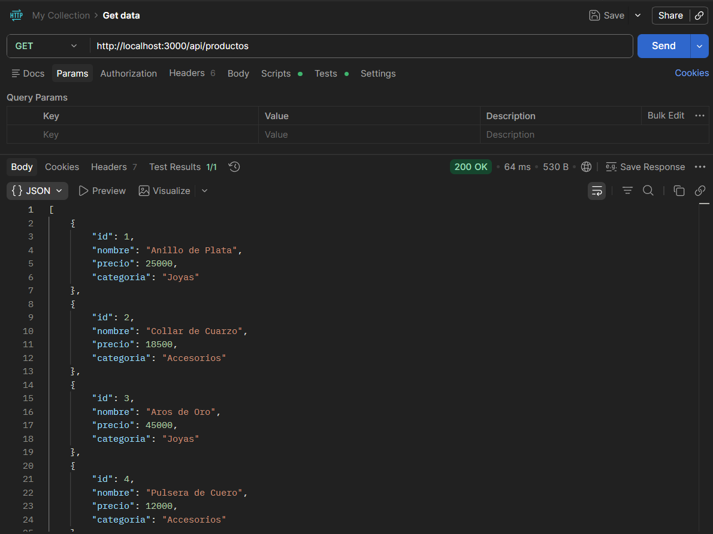
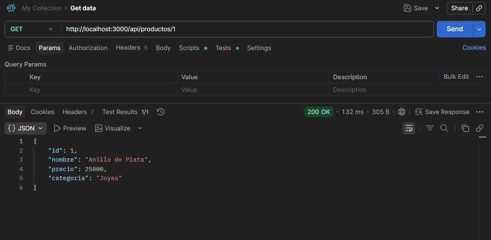
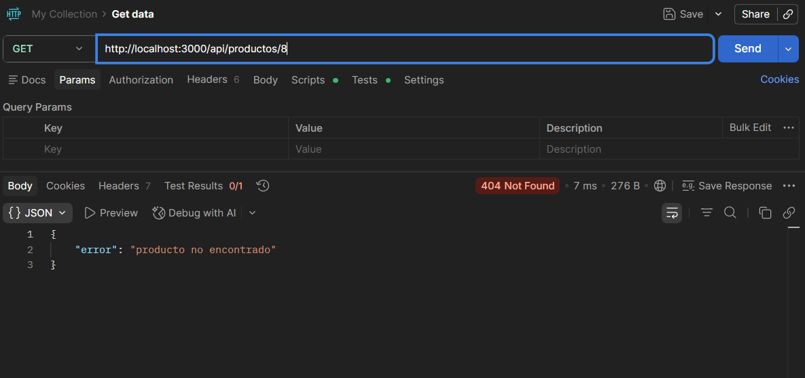
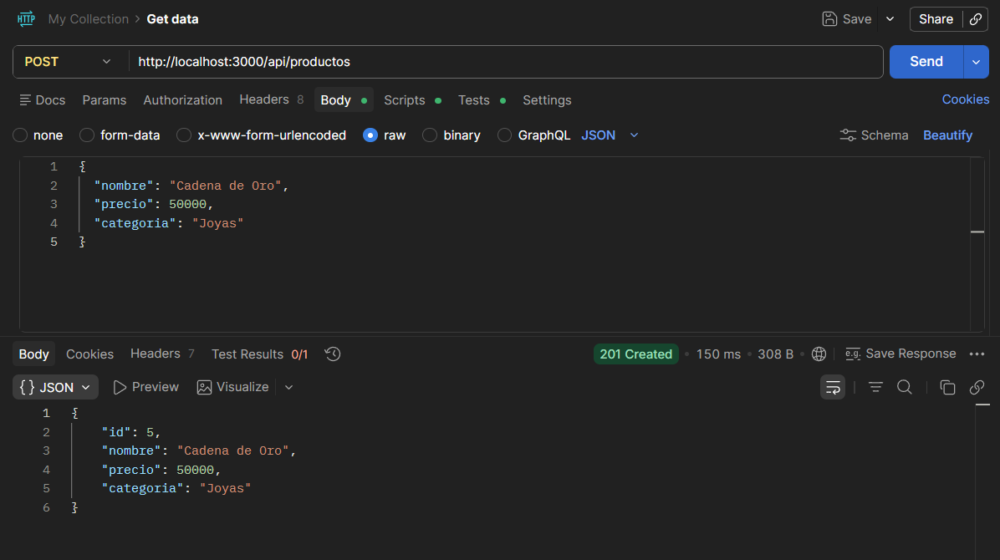
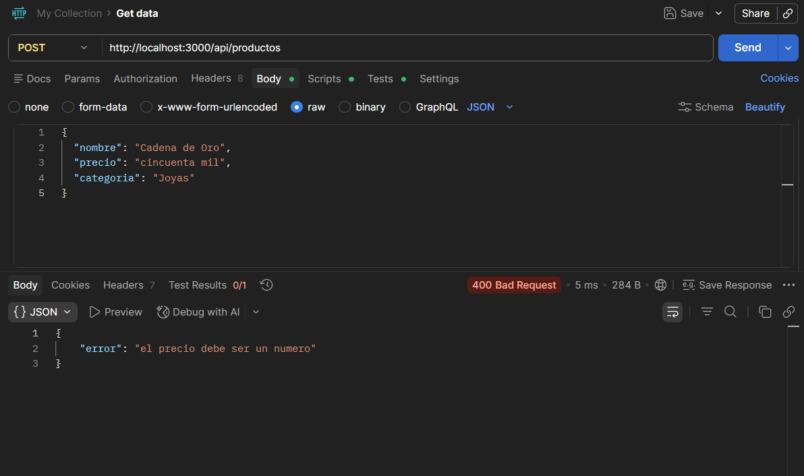
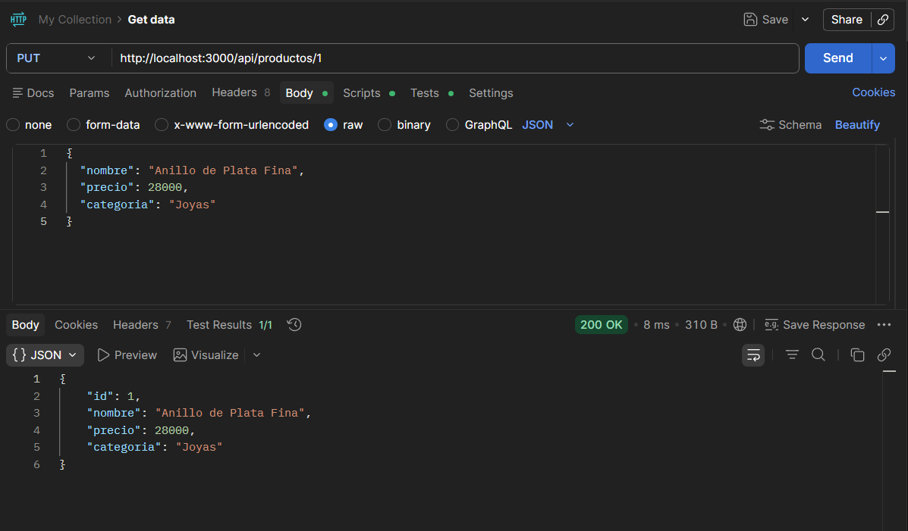
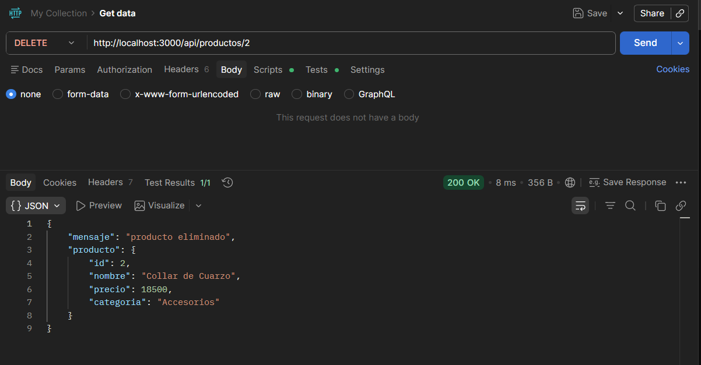

# 🚀 API RESTful de Productos

---

## 📌 Información del Proyecto

👤 Nombre: Jose Garrido  
📚 Asignatura: Programación Backend  
🏫 Institución: Instituto Profesional IPG

---

## 📌 Descripción

API RESTful desarrollada con Node.js y Express que permite gestionar un catálogo de productos mediante operaciones CRUD (Crear, Consultar, Actualizar y Eliminar).

---

## ⚙️ Funcionalidades

- 📋 Listar productos
  - Obtiene todos los productos registrados.

- 🔎 Buscar producto por ID
  - Permite consultar un producto específico.

- ➕ Crear productos
  - Agrega nuevos productos al catálogo.

- ✏️ Actualizar productos
  - Modifica la información de productos existentes.

- 🗑️ Eliminar productos
  - Remueve productos del sistema.

- 📡 Respuestas HTTP
  - Manejo de códigos de estado y respuestas JSON.

---

## 🛠️ Tecnologías utilizadas

- 🟢 Node.js
- ⚡ Express
- 📦 NPM
- 📬 Postman
- 💻 Visual Studio Code
- 📄 JSON

---

## 📂 Estructura del Proyecto

```text
📁 api-productos
│
├── 📄 index.js
├── 📄 routes.js
├── 📄 data.js
├── 📄 package.json
├── 📄 README.md
└── 📁 images
```

---

## 📥 Instalación y ejecución

```bash
git clone https://github.com/josegarrido0312-ux/api-productos.git

cd api-productos

npm install

npm start
```

Servidor disponible en:

```text
http://localhost:3000
```

---

# 📡 Endpoints Disponibles

## 📋 GET - Obtener todos los productos

### Petición

```http
GET /api/productos
```

### Respuesta

```json
[
  {
    "id": 1,
    "nombre": "Anillo de Plata",
    "precio": 25000,
    "categoria": "Joyas"
  }
]
```

### 📷 Evidencia



---

## 🔎 GET - Obtener producto por ID

### Petición

```http
GET /api/productos/1
```

### Respuesta exitosa

```json
{
  "id": 1,
  "nombre": "Anillo de Plata",
  "precio": 25000,
  "categoria": "Joyas"
}
```

### 📷 Evidencia



### Error 404

```json
{
  "error": "producto no encontrado"
}
```

### 📷 Evidencia



---

## ➕ POST - Crear producto

### Petición

```http
POST /api/productos
```

### Body

```json
{
  "nombre": "Cadena de Oro",
  "precio": 50000,
  "categoria": "Joyas"
}
```

### Respuesta exitosa

```json
{
  "id": 5,
  "nombre": "Cadena de Oro",
  "precio": 50000,
  "categoria": "Joyas"
}
```

### 📷 Evidencia



### Error 400

```json
{
  "error": "el precio debe ser un numero"
}
```

### 📷 Evidencia



---

## ✏️ PUT - Actualizar producto

### Petición

```http
PUT /api/productos/1
```

### Body

```json
{
  "nombre": "Anillo de Plata Fina",
  "precio": 28000,
  "categoria": "Joyas"
}
```

### Respuesta

```json
{
  "id": 1,
  "nombre": "Anillo de Plata Fina",
  "precio": 28000,
  "categoria": "Joyas"
}
```

### 📷 Evidencia



---

## 🗑️ DELETE - Eliminar producto

### Petición

```http
DELETE /api/productos/1
```

### Respuesta

```json
{
  "mensaje": "producto eliminado"
}
```

### 📷 Evidencia



---

## 🌐 Repositorio

🔗 https://github.com/josegarrido0312-ux/api-productos

---

## 🎯 Objetivo del Proyecto

Implementar una API RESTful utilizando Node.js y Express, aplicando operaciones CRUD, manejo de respuestas HTTP y buenas prácticas de desarrollo backend.

---

## 👨‍💻 Autor

Proyecto desarrollado por **Jose Garrido** con fines académicos para la asignatura de **Programación Backend**.

